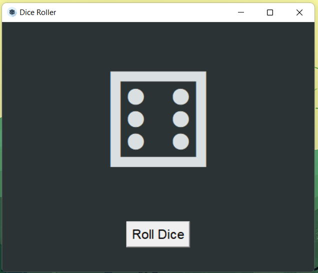
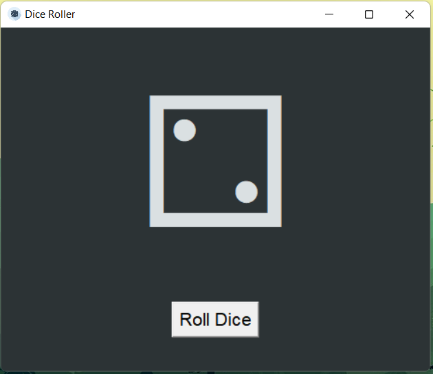

# Virtual Dice Simulator with Python:

### This is a Virtual Dice face Generator made using Tkinter and Randon module of Python


## Appendix

### Here's a first look of the final Result hope you'll like it.






## Authors

- [@DeeprajBaidya](https://www.github.com/deepraj02)
- [@MKBHD-Alpha](https://github.com/MKBHD-alpha)

  
## Badges

[](https://github.com/tterb/atomic-design-ui/blob/master/LICENSEs)

## Contributing

Contributions are always welcome!

See `contributing.md` for ways to get started.

Please adhere to this project's `code of conduct`.

  
## Installation

### Install my-project with https

```bash
  git clone https://github.com/MKBHD-alpha/Virtual-Dice.git
  cd Virtual-Dice
  python main.py
```
### Install my project with Github-Cli
Make sure You have Github-Cli installed in your Machine, to install Cli refer to [Github-Cli](https://github.com/cli/cli) 
<br>
```bash
    gh repo clone MKBHD-alpha/Virtual-Dice
    cd Virtual-Dice
    python main.py
```

# Thank you and Happy Coding...